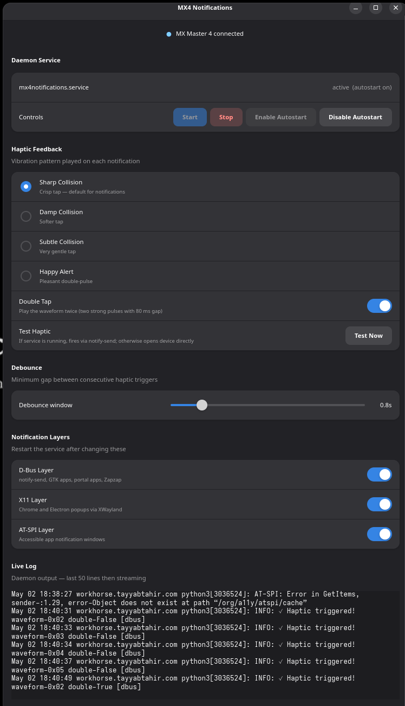

# MX Master 4 Haptic Setup for Linux (Fedora / Ubuntu / GNOME)



Full setup guide for **Logitech MX Master 4** on Linux with GNOME and Wayland.

Tested on: **Fedora 44, GNOME Shell 50, Wayland + XWayland, Logi Bolt receiver**
Also tested on: Fedora 43, GNOME Shell 49.5

> **Upgrading from Fedora 43 → 44?** See the [Fedora 44 upgrade notes](#fedora-44--gnome-50-upgrade-notes) below.

## What this does

| Feature | Description |
|---|---|
| **Haptic on notifications** | Mouse vibrates every time you get a desktop notification |
| **Ctrl + Right arrow** | Top button on mouse switches to next workspace |

---

## Project structure

```
mx4notifications/
├── src/
│   ├── watch.py              # Notification haptic service (3-layer monitor)
│   └── mx_master_4.py        # HID++ driver for MX Master 4 haptic motor
├── config/
│   ├── logid.cfg             # logiops mouse button config
│   ├── udev/
│   │   └── 99-mx4notifications.rules
│   └── systemd/
│       ├── system/
│       │   ├── logid-reinit.timer          # Restarts logid 20s after boot
│       │   ├── logid-reinit.service
│       │   └── logid.service.d/
│       │       └── release-keys.conf       # Releases stuck keys on logid stop
│       └── user/
│           └── mx4notifications.service    # Haptic notification service
├── scripts/
│   ├── install.sh            # One-shot install script (Fedora)
│   ├── install-ubuntu.sh     # One-shot install script (Ubuntu)
│   └── logid-release-keys.py # Releases stuck modifier keys
└── README.md
```

---

## Quick install

**Fedora 44 (GNOME 50):**
```bash
git clone https://github.com/tayyabtahir143/mx4notifications.git
cd mx4notifications
git checkout Fedora44Gnome50Fix
chmod +x scripts/install.sh
./scripts/install.sh
```

**Fedora 43 and earlier:**
```bash
git clone https://github.com/tayyabtahir143/mx4notifications.git
cd mx4notifications
git checkout mx4haptic
chmod +x scripts/install.sh
./scripts/install.sh
```

**Ubuntu (22.04 / 24.04):**
```bash
git clone https://github.com/tayyabtahir143/mx4notifications.git
cd mx4notifications
git checkout mx4haptic
chmod +x scripts/install-ubuntu.sh
./scripts/install-ubuntu.sh
```

Then **log out and back in**, reconnect the mouse, and you're done.

---

## Manual install (step by step)

Follow this if you prefer to do things manually or the install script fails.

### Step 1 — Install logiops

logiops is the daemon that controls Logitech mice on Linux.

```bash
sudo dnf install logiops
```

> **Ubuntu/Debian:** logiops is not in default repos. Build from source:
> ```bash
> sudo apt install cmake libevdev-dev libudev-dev libconfig++-dev
> git clone https://github.com/PixlOne/logiops.git
> cd logiops && mkdir build && cd build
> cmake .. && make && sudo make install
> ```

---

### Step 2 — Install Python dependencies

```bash
# System packages
sudo dnf install python3-gobject python3-xlib at-spi2-core python3-evdev

# Python HID package (for haptic motor communication)
pip3 install --user hid
```

---

### Step 3 — Add your user to the input group

Required so the Python services can read `/dev/hidraw*` and `/dev/input/event*` devices.

```bash
sudo usermod -a -G input $USER
```

**Log out and back in** for this to take effect.

---

### Step 4 — Install udev rule

This gives the `input` group access to Logitech HID devices.

```bash
sudo cp config/udev/99-mx4notifications.rules /etc/udev/rules.d/
sudo udevadm control --reload-rules
```

---

### Step 5 — Install logid config

This configures your MX Master 4 mouse buttons.

```bash
sudo cp config/logid.cfg /etc/logid.cfg
```

**What each button does after this config:**

| Button | Action |
|---|---|
| Top button (CID 0xc4) | `Ctrl + Right` → next workspace |

---

### Step 6 — Install logid systemd units

#### 6a. Drop-in to release stuck keys when logid stops

```bash
sudo mkdir -p /etc/systemd/system/logid.service.d
sudo cp config/systemd/system/logid.service.d/release-keys.conf /etc/systemd/system/logid.service.d/
sudo cp scripts/logid-release-keys.py /usr/local/bin/logid-release-keys.py
sudo chmod +x /usr/local/bin/logid-release-keys.py
```

#### 6b. Boot timer to re-discover Bolt devices

The Logi Bolt receiver does not re-enumerate already-connected devices when logid starts.
This timer restarts logid 20 seconds after boot, by which time the mouse has woken up.

```bash
sudo cp config/systemd/system/logid-reinit.timer /etc/systemd/system/
sudo cp config/systemd/system/logid-reinit.service /etc/systemd/system/
sudo systemctl daemon-reload
sudo systemctl enable --now logid.service
sudo systemctl enable --now logid-reinit.timer
```

---

### Step 7 — Install user service

#### Haptic notification service (`mx4notifications`)

Monitors for desktop notifications and vibrates the mouse.

```bash
mkdir -p ~/.config/systemd/user
cp config/systemd/user/mx4notifications.service ~/.config/systemd/user/
systemctl --user daemon-reload
systemctl --user enable --now mx4notifications.service
```

---

### Step 8 — Enable AT-SPI accessibility (for Layer 3 notification detection)

```bash
gsettings set org.gnome.desktop.interface toolkit-accessibility true
```

---

### Step 9 — Disable Solaar autostart (important!)

Solaar conflicts with logid — both try to control the mouse simultaneously, causing
the gesture button to get stuck and keyboard/mouse to behave erratically.

```bash
sed -i 's/X-GNOME-Autostart-enabled=true/X-GNOME-Autostart-enabled=false/' \
    ~/.config/autostart/solaar.desktop
```

Or open **GNOME Settings → Apps → Startup Applications** and disable Solaar.

---

### Step 10 — Test everything

**Test notification haptic:**
```bash
notify-send "Test" "You should feel a buzz on your mouse!"
```

**Test workspace switch:**
Press the top mouse button → should switch to next workspace.

---

## Verify services are running

```bash
# Check services
sudo systemctl status logid.service --no-pager
systemctl --user status mx4notifications.service --no-pager

# Live logs
journalctl --user -u mx4notifications -f
sudo journalctl -u logid -f
```

---

## How it works

### Notification haptics (`watch.py`)

Three layers run in parallel to catch notifications from any source:

```
Any notification source
        ↓
   ┌────┴──────────────────────────────┐
   │  Layer 1: D-Bus monitor           │ ← notify-send, GTK apps, portal apps, Zapzap
   │  Layer 2: X11 window events       │ ← Chrome, Electron popup notifications
   │  Layer 3: AT-SPI accessibility    │ ← Any accessible app with alert windows
   └────┬──────────────────────────────┘
        ↓  (1.5s debounce)
  HID++ HAPTIC feature (0x19B0), waveform 0x05 (HAPPY_ALERT)
        ↓
  MX Master 4 vibrates
```

---

## Fedora 44 / GNOME 50 upgrade notes

If you upgraded from Fedora 43 to Fedora 44 and now get stuck in a **login loop** (you enter your password and get sent back to the login screen), this service is likely the cause.

### Why it happens

GNOME 50 (shipped in Fedora 44) added a strict check: if `graphical-session.target` is already active when you log in, GNOME crashes and kicks you back to the login screen.

The old version of this service had `Requires=graphical-session.target` and was installed under `default.target.wants/`. This caused the service to start at boot (before you even logged in), which activated `graphical-session.target` too early. GNOME then saw it already active and refused to start.

### How to fix it (if you are stuck in the login loop)

1. Press **Alt + Ctrl + F3** to open a terminal on the login screen.
2. Log in with your username and password.
3. Run these commands:

```bash
# Stop the stale session target
systemctl --user stop graphical-session.target
systemctl --user reset-failed

# Remove the bad service symlink
rm ~/.config/systemd/user/default.target.wants/mx4notifications.service

# Re-enable the service correctly
systemctl --user disable mx4notifications.service
systemctl --user enable mx4notifications.service
systemctl --user daemon-reload

# Restart the login screen
sudo systemctl restart gdm
```

4. Press **Ctrl + Alt + F1** to go back to the login screen. It will now work.

### What changed in this branch

| What | Old (Fedora 43) | New (Fedora 44) |
|---|---|---|
| Service dependency | `Requires=graphical-session.target` | `PartOf=graphical-session.target` |
| Service start trigger | `default.target.wants/` (at boot) | `graphical-session.target.wants/` (after login) |
| `DISPLAY` env var | Hardcoded `:0` | Inherited from GNOME session |
| `XAUTHORITY` env var | Hardcoded `~/.Xauthority` | Inherited from GNOME session |
| Haptic waveform | `0x00` (not supported on this device) | `0x05` HAPPY_ALERT (confirmed working) |

The `PartOf=` change means: the service is part of the graphical session and will stop when you log out, but it will never force the session target to activate on its own. This is the correct behaviour.

The `XAUTHORITY` fix matters because Fedora 44 + Mutter/Wayland stores the X auth file at a random path like `/run/user/1000/.mutter-Xwaylandauth.XXXXXX` which changes on every boot. The old hardcoded `~/.Xauthority` path no longer exists, which caused the X11 notification layer to fail silently.

The waveform fix matters because waveforms `0x00` and `0x01` are defined in the HID++ spec but are **not supported** by the MX Master 4 hardware. The device silently ignores them. The supported waveforms (confirmed via Solaar `GetCapabilities`) are:

| ID | Name | Feel |
|---|---|---|
| `0x02` | SHARP_COLLISION | Crisp tap |
| `0x03` | DAMP_COLLISION | Softer tap |
| `0x04` | SUBTLE_COLLISION | Gentle tap |
| `0x05` | HAPPY_ALERT | Double-pulse (default) |

---

## Troubleshooting

### logid not finding mouse after boot

The Logi Bolt receiver doesn't re-enumerate already-connected devices.
The `logid-reinit.timer` handles this automatically (restarts logid 20s after boot).
If it still doesn't work, move the mouse or click a button, then:

```bash
sudo systemctl restart logid
```

### Mouse/keyboard behaving erratically after pressing gesture button

This is caused by Solaar running alongside logid. Stop Solaar and disable it from autostart (Step 9 above).

If keys are stuck, restart logid — the `release-keys.conf` drop-in will automatically release stuck modifier keys:

```bash
sudo systemctl restart logid
```

### Login loop after upgrading to Fedora 44

See the [Fedora 44 upgrade notes](#fedora-44--gnome-50-upgrade-notes) section above for the fix.

---

### No haptic on notifications

```bash
# Check service logs
journalctl --user -u mx4notifications -f

# Send a test notification
notify-send "Test" "Message"
```

If the mouse is not found, the service retries every 5 seconds. Check if your user is in the `input` group:

```bash
groups $USER | grep input
```

---

## Setting up on another computer

1. Clone this repo
2. Run `./scripts/install.sh`
3. Log out and back in

Settings replicate automatically to any MX Master 4 — logiops identifies devices by name (`"MX Master 4"`), so any unit of the same model gets the same config.
